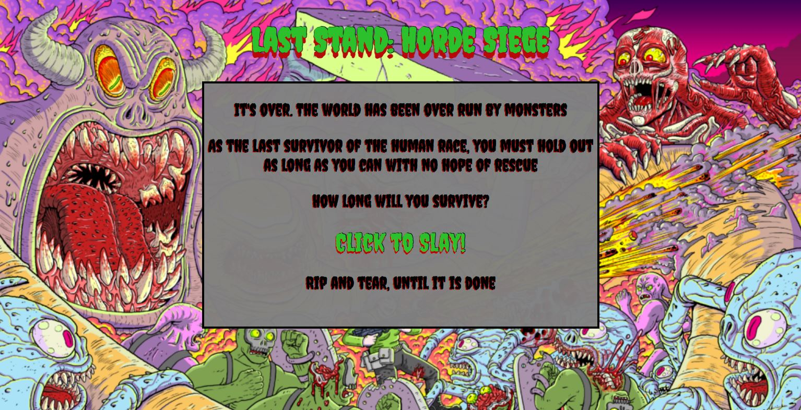
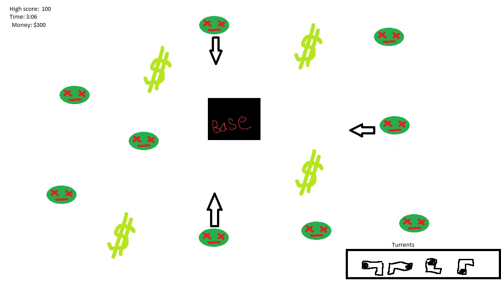

# Last-Stand-Horde-Siege

Week 6: Mod 1: The Game

<a href="https://arnaldopires.com/Last-Stand-Horde-Siege/">Play the game here</a>

This game was created as a school project for the web development course at Per Scholas.

This is my current work in progress verison of the ever popular and newish reverse bullet hell genre of games/ tower defense

The main objective of the game is to survive as long as possible, while racking up a high score

More features to come....

<h2>How to play:</h2>

Once you click on "Click to Slay!" You will be brought to your base.

Project your base at all costs by clicking on the incoming monsters that will rapidly approach your base.

Clicking on them will shoot out a projectile.

Killing monsters give you points.

Keep doing this until you are defeated.

If you get defeated, click on the "Play again" button to start another round.

<h2>How I built the game:</h2>

This game was built with HTML,CSS, and JavaScript

Before I started working on the game, I used paint to sketch out what I wanted the game to look like:

As you can see, I am not the greatest artist, but hopefully this drawing gives you some of an idea of what I was going for.

Most of the code was done using HTML5 Canvas. Up until now, I never really used it before so this project was quite interesting, and I had a lot of fun putting things together.

<h2>Challenges:</h2>

I faced a lot of challenges trying to get this whole thing to work, especially since I've never done anything like this before.

Trying to get the projectiles to shoot where I wanted it aimed based off the mouse location...

Getting canvas and objects in the canvas to appear and change up based off of screen size...

Getting the enemies to function to know where the base is, and getting them to attack it properly...

Just to name a few of the problems no doubt...

But overall and good time putting it all together so far.

<h>Features I would like to add:</h>

A turret system that will auto shoot the monsters for you

Better scaling difficultly

Scores being saved

Using your points to create alt fire abilities

Powerups

Particle effects

Better mobile version

Voice over effects

<h2>Assets used:</h2>

Background Image comes from a game called Torment X Punisher.

Voice over is actually my voice

Music is from a game called Hotline Miami

For now, I just used emoji's for the base and monsters

<h2>Resources that helped me:</h2>

<a href="https://www.youtube.com/watch?v=sH5A520rqiQ&ab_channel=6PackProgrammer">Bring Your Game to Life: Create a 2D Shooting Game with JavaScript & HTML Canvas</a>

<a href="https://www.youtube.com/watch?v=eI9idPTT0c4&ab_channel=ChrisCourses">HTML5 Canvas and JavaScript Game Tutorial</a>

<a href="https://www.youtube.com/watch?v=QxYg8-mhhhs&ab_channel=Frankslaboratory">JavaScript Game Tutorial - 2D Tower Defense</a>

